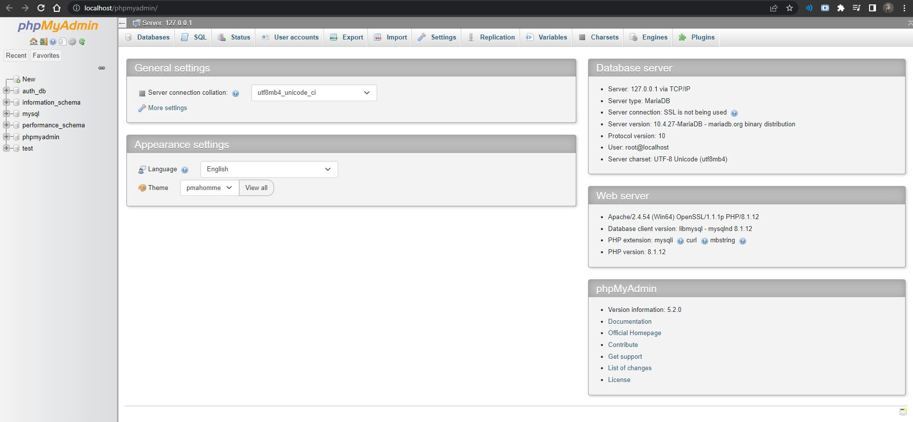
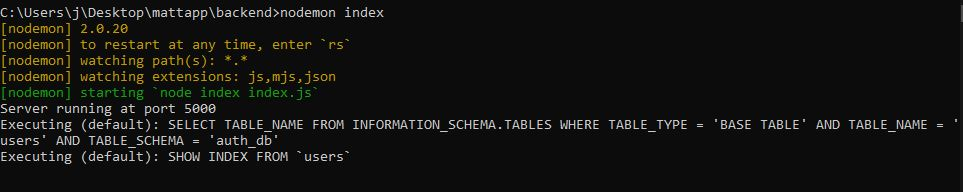
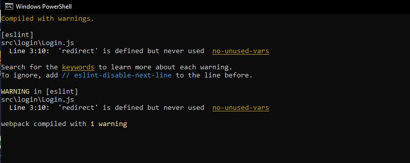

## Matting Web App

### Installation

You will need Node.js and NPM. You can refer to this link here for installation.

https://radixweb.com/blog/installing-npm-and-nodejs-on-windows-and-mac

<br>

After installing npm,

cd to ./frontend and ./backend and install the dependencies first

```
npm install
```

<br>

#### For backend (SQL server)

You can install XAMPP, but you will need the Apache and MySQL module to start the service.

You might need to change the ports configuration to ensure that the server runs correctly.


Your XAMPP Control Panel should look similar to this.


After the service has started, you can click on Admin which will bring you to this page.


In cmd, run

```
nodemon index
```

And you should see something similar to this which indicates that the server has started properly.



<br>

#### For frontend

In cmd, run

```
npm start
```

And you should see something similar which indicates that the web app has started successfully.



<br>

### Features


<br>

### To-do

- [x] Add routing for registration and login pages
- [x] Route normal user and admin to their respective pages 
- [x] Add delete user feature for admin control
- [ ] Integrate matting feature
